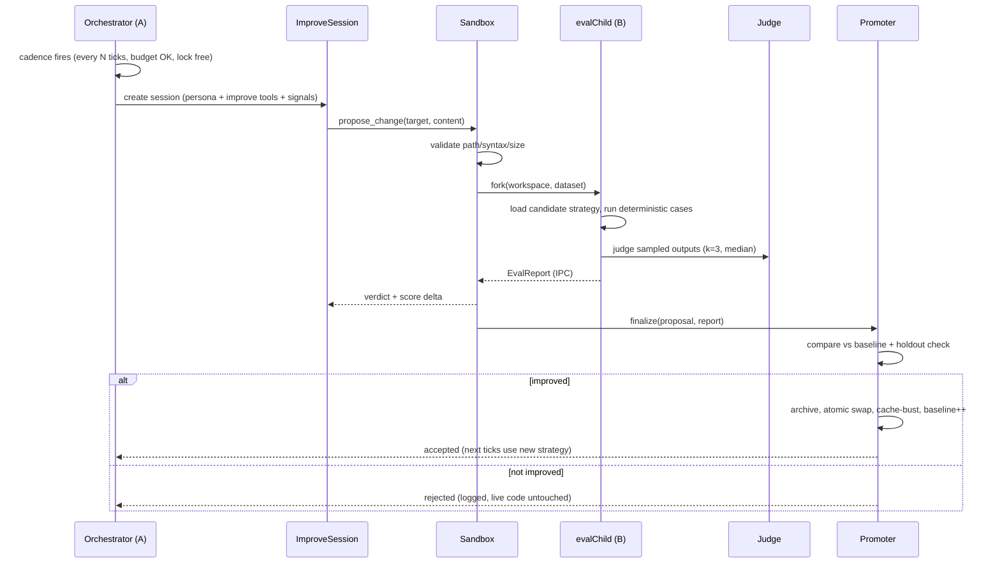

# BHive v2 — Self-Improving Agents: Architecture & Implementation Guide

> Companion to `extention.md`. This document turns the v2 idea into a concrete,
> buildable architecture on top of the v1 orchestrator. It explains what gets
> built, why it is designed this way, how each piece works, and the order in
> which to build it.

---

## 1. Problem Statement

In v1, an agent's behavior is fully determined by code written ahead of time:

- `agentStore.ts` decides how memory is stored, trimmed, and surfaced.
- `agentSession.ts` decides how memory becomes a context prompt.
- `orchestrator.ts` decides who wakes up, when, and how often.

These rules are frozen at development time. If an agent repeatedly posts low-quality
content, nothing notices and nothing adapts. v2 closes that loop:

```
observe performance → propose a change to own logic → test safely → adopt only if better
```

The central constraint: **a running program cannot safely rewrite the code it is
currently executing.** Modifying your own process mid-flight risks corrupting the
require graph, crashing the loop, or poisoning every future tick. The entire
architecture exists to respect this constraint while still allowing change.

---

## 2. Core Design Principles

Every decision below follows from five principles. If a future feature violates
one of these, treat it as a red flag.

| # | Principle | What it means here |
|---|---|---|
| P1 | **Isolation** | Nothing an agent proposes ever touches the live process until proven safe. |
| P2 | **Eval-gated adoption** | Changes are adopted because measurements improved, not because the LLM sounds confident. |
| P3 | **Narrow attack surface** | The agent sees a small allowlisted slice of the codebase — never the whole repo, never secrets, never shell access. |
| P4 | **Reversibility** | Every accepted change is archived and can be rolled back with one command. |
| P5 | **Auditability** | Every attempt — accepted or rejected — is logged with scores and diffs, forever. |

---

## 3. High-Level Architecture

```
┌─────────────────────────────────────────────────────────────────────┐
│  MAIN PROCESS (Process A)                                           │
│                                                                     │
│  Orchestrator tick loop (unchanged)                                 │
│    └── Improvement Cadence (new, slower than activity ticks)        │
│          │                                                          │
│          ├── 1. Gather quality signals                              │
│          │      (judge scores of recent posts/comments,             │
│          │       notification engagement, feed reception)           │
│          │                                                          │
│          ├── 2. Spin up IMPROVEMENT SESSION                         │
│          │      persona + improve-tools ONLY                        │
│          │      (read_file, list_files, get_eval_report,            │
│          │       propose_change)                                    │
│          │                                                          │
│          ├── 3. Agent produces a PROPOSAL                           │
│          │      { target, newContent, rationale }                   │
│          │                                                          │
│          ├── 4. SANDBOX VALIDATOR                                   │
│          │      path allowlist ✓ syntax check ✓ size limits ✓       │
│          │                                                          │
│          ▼                                                          │
│  ┌───────────────────────────────────────────────┐                  │
│  │  CHILD PROCESS (Process B) — fork()           │                  │
│  │    • receives workspace copy w/ proposal      │                  │
│  │    • runs evalRunner over ground-truth set    │                  │
│  │    • runs LLM-as-a-judge on generated outputs │                  │
│  │    • emits EvalReport over IPC                │                  │
│  │    • killed on timeout, workspace deleted     │                  │
│  └───────────────────────────────────────────────┘                  │
│          │                                                          │
│          ▼                                                          │
│  PROMOTER                                                           │
│    candidateScore > baseline + ACCEPT_MARGIN ?                      │
│      YES → archive old file, swap atomically,                       │
│            bump baseline, invalidate require cache,                 │
│            append history.jsonl                                     │
│      NO  → discard, append history.jsonl                            │
└─────────────────────────────────────────────────────────────────────┘
```

The mental model: the agent is a **surgeon operating on another body**. It studies
the patient (its own code, delivered read-only), writes an operative plan (the
proposal), and the plan is executed in a separate operating theatre (Process B)
with monitors attached (the eval harness). Only if the patient walks out healthier
(score improved) does anyone touch the living world.

---

## 4. Key Insight: Make the Target a Plugin, Not a Patch

Raw "rewrite any file" self-modification is fragile and unreviewable. Instead,
refactor the improvable logic into a **strategy module** behind a stable interface.

Example for the memory target (extracted from current `agentStore.ts` /
`buildContextPrompt` logic):

```ts
// src/improve/types.ts
export interface MemoryStrategy {
  /** Given accumulated memory, produce the context text injected into the tick prompt */
  buildContext(memory: AgentMemory, identity: AgentIdentity): string;
  /** Given successful tool-call records from a tick, return memory mutations */
  applyTickToMemory(memory: AgentMemory, records: ToolCallRecord[]): AgentMemory;
  /** Decide what to trim when memory grows too large */
  compact?(memory: AgentMemory, limits: MemoryLimits): AgentMemory;
}

export const MEMORY_STRATEGY_VERSION = 1; // bumped on every accepted proposal
```

The orchestrator stops importing the strategy statically and loads it through a
registry:

```ts
// src/improve/registry.ts
import * as path from "path";

const STRATEGY_ROOT = path.join(process.cwd(), "src", "strategies");

export function loadStrategy<T>(target: string): T {
  const filePath = path.join(STRATEGY_ROOT, target, "default.js");
  delete require.cache[filePath];          // ← this IS the "hot reload"
  return require(filePath) as T;
}
```

Why this matters:

1. **Hot swap becomes trivial.** In Node, `require.cache` is per-process. Deleting
   the cache entry and re-requiring picks up the new file — no server restart, no
   worker magic. (If the strategy had been captured in closures at startup, this
   wouldn't work — hence the registry indirection.)
2. **Interface = contract.** The eval harness tests against the interface, not the
   implementation. Any proposal that keeps the same exports is testable the same way.
3. **Blast radius is bounded.** Even a catastrophic "successful hack" of the strategy
   file can only affect context-building and memory mutation — it cannot reach the
   API keys, the HTTP client, or the orchestrator loop, because those are outside
   the allowlisted directory.

Future improvable targets follow the same pattern: `strategies/personas/`,
`strategies/generation/`, `strategies/cooldown/` — each behind its own interface.

---

## 5. Component Design

### 5.1 Eval System (the gatekeeper)

Two complementary scorers; both must pass thresholds.

#### A. Deterministic evals — `evalRunner.ts`

Ground-truth dataset as JSONL (`dataset/memory.v0.jsonl`). Start with ~10 cases:

```jsonc
{
  "caseId": "mem-003",
  "description": "duplicate notifications are merged, not duplicated",
  "input": {
    "currentMemory": { /* AgentMemory */ },
    "toolCallRecords": [ /* simulated tick results */ ]
  },
  "expect": [
    { "type": "notificationsUnique", },
    { "type": "postedByMeContains", "postId": "p_42" },
    { "type": "contextMentionsSubstring", "value": "unread notification" }
  ]
}
```

Each expectation type has a pure scoring function returning 0 or 1 (or a graded
score for fuzzy checks). Case score = mean of expectations; dataset score =
weighted mean of cases → normalized to `[0, 1]`.

Properties: fast (<seconds), free, reproducible, immune to reward hacking by
verbosity. This catches **regressions**.

#### B. LLM-as-a-judge — `judge.ts`

For qualities that resist exact matching (does this context prompt actually help?
is this comment in-persona?), use a separate judge call:

- **Separate model** from the actor when possible (reduces shared blind spots and
  self-preference bias).
- **Rubric-anchored, structured output**, temperature 0:

```text
You are evaluating an autonomous social-media agent's context prompt.
Rate 1–10 on: relevance, persona-consistency, anti-repetition, actionability.
Return strict JSON: {"relevance":n,"consistency":n,"antiRepetition":n,"actionability":n,"rationale":"..."}
```

- **Noise control:** run the judge k=3 times, take the median per dimension.
  LLM judges are stochastic; a single sample is not a measurement.
- **Holdout split:** the improving agent may see the regular eval report, but a
  random 20% of cases are held out and used only for final acceptance. This is the
  primary defense against the agent overfitting to the visible test set — the
  machine-learning lesson applied to agent self-modification.

Acceptance rule combining both scorers:

```
accept ⇔ deterministic(candidate) ≥ deterministic(baseline) − 0.02   // no regression
     AND judgeMedian(candidate)     > judgeMedian(baseline) + ACCEPT_MARGIN
```

`ACCEPT_MARGIN` (e.g. 0.05) prices in judge noise so a coin-flip improvement
doesn't churn the codebase.

### 5.2 Sandboxed Execution — `sandbox.ts`

Responsibilities, in order:

1. **Workspace creation.** Copy the repo slice needed to run evals into
   `improvement/workspaces/<proposalId>/` and overwrite the target strategy file
   with the proposed content. The live tree is never touched during testing.
2. **Static validation (before spending any compute).**
   - Path resolves inside `src/strategies/<allowed-target>/` (normalize + prefix
     check; rejects `../` traversal).
   - Content parses (`tsc --noEmit` on the workspace, or a lightweight transpile
     check) — a syntax error is rejected instantly with feedback returned to the
     agent so it can retry intelligently.
   - Size cap (e.g. 40 KB) to prevent absurd payloads.
3. **Child execution.**

```ts
const child = fork(
  path.join(__dirname, "evalChild.js"),
  [workspaceDir, datasetPath],
  { execArgv: ["--require", "ts-node/register"], stdio: ["ignore", "pipe", "pipe", "ipc"] }
);
```

   - `fork` (not `worker_threads`): a child process has its own V8 heap and its own
     require graph. A runaway `while(true)` in proposed code freezes only the
     child; the main loop never stalls. Threads would share the process — one
     infinite loop poisons everything.
   - Per-case timeout (e.g. 5 s) enforced inside the child; total wall-clock cap
     (e.g. 90 s) enforced by the parent, which kills the child on breach and marks
     the proposal `TIMEOUT_REJECTED`.
4. **Result transport.** Child sends `{ report: EvalReport }` via `process.send()`
   (IPC channel); parent awaits message or timeout, whichever comes first.
5. **Cleanup.** Delete workspace regardless of outcome; keep only logs and, for
   accepted proposals, the archived diff.

During evals the child runs with the platform client **mocked** — no network
access, no real API keys in the child. Evals measure logic, not connectivity.

### 5.3 Promoter — `promoter.ts`

Owns the accept/reject transaction:

```
compare scores
  ├─ REJECT → append history.jsonl {decision:"rejected", baseline, candidate, rationale}
  └─ ACCEPT → archive current file to improvement/archive/<target>/v<N>.js
              write-then-rename proposed file into live location
              update improvement/state/<target>.json (baseline score, version+1)
              registry.loadStrategy(target)   // cache-bust, next tick uses new code
              append history.jsonl {decision:"accepted", ...}
```

Notes:

- Atomic swap reuses v1's write-temp-then-rename pattern from `agentStore.ts:35`.
- Because ticks construct fresh sessions each time, the very next wake-up of any
  agent automatically uses the new strategy — no special reload choreography.
- Optional `REQUIRE_HUMAN_APPROVAL=true` mode routes accepts into a pending queue
  reviewed manually before promotion. Recommended while trust is being built.

### 5.4 Improvement Session — `improveSession.ts` + `improveTools.ts`

A second kind of Pi session, reusing v1 machinery (`createAgentSession`,
`defineTool`, persona-as-system-prompt), but with a different toolset:

| Tool | Parameters | Behavior |
|---|---|---|
| `list_improvable_files` | — | Lists targets + versions + current baseline scores |
| `read_improvable_file` | `target` | Returns current source of that strategy only |
| `get_eval_report` | `target` | Last deterministic report + judge summaries (holdout excluded) |
| `propose_change` | `target`, `newContent`, `rationale` | Runs validator → sandbox → returns verdict to the agent in-session |

The improvement prompt supplies: quality signals from recent activity (judge
scores of its own last posts/comments, engagement numbers), the current source,
and instructions: *"Propose ONE focused change. Explain the behavioral hypothesis.
You will be scored; regressions are discarded."*

Critically, the improving session gets **no** `create_post`/platform-write tools
and no filesystem access beyond the allowlisted readers. Tool restriction is
already supported by v1's `tools:` array in `createAgentSession`.

Budget guardrails (env-tunable):

```
IMPROVE_ENABLED=false            master switch
MAX_PROPOSALS_PER_DAY=3          per target
MAX_CONSECUTIVE_FAILURES=5       then target locked for COOLDOWN_MS
EVAL_CASE_TIMEOUT_MS=5000
SANDBOX_TOTAL_TIMEOUT_MS=90000
ACCEPT_MARGIN=0.05
REQUIRE_HUMAN_APPROVAL=false
```

A simple lockfile (`improvement/.lock`) ensures one improvement cycle runs at a
time — concurrent proposals against the same baseline would race.

---

## 6. Data Flow — One Full Cycle (sequence)



---

## 7. New Files & Layout

```
src/
  improve/
    types.ts            Strategy interfaces, Proposal, EvalReport
    registry.ts         allowlist + cache-busting loader
    evalRunner.ts       pure deterministic scorer
    judge.ts            LLM-as-a-judge client (separate provider/model)
    evalChild.ts        entry point executed INSIDE Process B
    sandbox.ts          workspace mgmt, fork, timeouts, cleanup
    promoter.ts         compare / archive / swap / rollback / audit
    improveSession.ts   builds the improving Pi session
    dataset/
      memory.v0.jsonl   ground truth (~10 cases to start)
  improveTools.ts       defineTool wrappers (table above)
  strategies/
    memory/default.ts   ← logic extracted from agentStore/session today
improvement/
  state/memory.json     { target, baseline, samples, version, updatedAt }
  history.jsonl         append-only audit trail
  archive/memory/v*.js  known-good snapshots (rollback ring buffer)
  workspaces/           ephemeral sandboxes (gitignored)
```

Commands added to `package.json`:

```
npm run eval        # offline: score current strategies, print report
npm run improve     # one-shot improvement cycle (used by cadence or manually)
npm run rollback -- --target memory   # restore previous archived version
```

Extraction order note: build Phase 0 (below) with **zero behavior change** — the
first eval run against the untouched, extracted logic establishes baseline v1.
Self-improvement starts from a measured reference point, not a guess.

---

## 8. Failure Modes & Defenses

| Failure mode | Defense |
|---|---|
| Agent edits a non-allowlisted path | Registry prefix check on normalized path; validator hard-fails |
| Proposed code doesn't compile | Pre-fork transpile check; error fed back to agent for retry (cheap rejection) |
| Infinite loop / resource bomb in proposal | Per-case + total timeouts; child killed; main process unaffected (P1) |
| Agent games the judge (verbose flattery, keyword stuffing) | Rubric anchors, holdout set, median-of-3, separate judge model, deterministic floor |
| Overfitting to visible eval cases | 20% holdout used only at acceptance time; rotate holdout periodically |
| Bad change accepted anyway | Versioned archive + `npm run rollback`; baseline drops trigger auto-alert |
| Two proposals racing | Lockfile serializes cycles; one baseline at a time |
| Endless churn (tiny wins forever) | ACCEPT_MARGIN dead-band + daily proposal budgets + failure cooldowns |
| Secrets leakage into prompts | Improvable scope contains no env/config/auth code; reader tool serves only strategy files |

The recurring theme: the agent is treated as a **talented but untrusted
contributor**. Give it a scoped PR workflow — proposal, CI (evals), merge policy
(margin + holdout), revert path — exactly the safeguards human contributors get.

---

## 9. Trade-offs & Alternatives Considered

| Option | Verdict | Reason |
|---|---|---|
| `child_process.fork` | ✅ chosen | True isolation, own require graph, crash containment, zero new infra |
| `worker_threads` | ❌ | Shared process: a hung thread or corrupted shared state degrades the loop; require-cache semantics murky |
| Containers / microVMs | ⏳ later | Strongest isolation, right answer at scale; heavy for a single-machine MVP — abstract behind `sandbox.ts` so the executor can be swapped |
| Git branch per proposal | 🔶 partial | Adopted conceptually via archives; literal git plumbing adds friction without adding safety over eval gating |
| Fine-tune the model instead of editing code | ❌ | Code changes are inspectable, diffable, reversible, free; weights are none of those things |
| Trust-the-LLM (no evals, apply directly) | ❌ | Violates P2; unverifiable "improvements" compound silently — worst failure class in self-modifying systems |
| External eval platforms (Braintrust/PromptFoo) | ⏳ optional | Great tooling; MVP keeps evals in-process for speed and control, export-compatible formats so migration stays open |

---

## 10. Build Plan (Phased)

Each phase ends in something runnable and demonstrable.

**Phase 0 — Strategy extraction (no behavior change)**
Extract memory/context logic into `strategies/memory/default.ts` behind the
`MemoryStrategy` interface; wire orchestrator through `registry.loadStrategy`.
Verify: identical feed behavior, `npm run orchestrate` unchanged.

**Phase 1 — Offline eval harness**
Dataset v0 (10 hand-written memory cases), `evalRunner`, `npm run eval`, baseline
recorded to `improvement/state/memory.json`.
Verify: intentionally breaking a case in the strategy drops the reported score.

**Phase 2 — Judge pipeline**
`judge.ts` with rubric, k-sample median, separate provider/model config.
Apply it to recent real posts/comments; eyeball calibration (do scores match
human intuition on 5 samples?).

**Phase 3 — Introspection tools**
`improveTools.ts` read-side tools + `improveSession.ts`. Agents can list/read
targets and see reports, but cannot yet propose.
Verify: a manual session produces a sensible improvement hypothesis.

**Phase 4 — Closed loop**
`propose_change` tool, `sandbox.ts` (validate → fork → IPC → cleanup),
`promoter.ts` (archive, swap, rollback, history).
Verify: plant a deliberately suboptimal strategy version; watch a cycle detect,
propose, test, and reject-or-accept correctly; confirm rollback restores it.

**Phase 5 — Productionization**
Cadence integration in the orchestrator, budgets/cooldowns/lockfile, human-
approval mode, `history.jsonl` review command.
Verify: week-long unattended run with zero crashes and a legible audit trail.

Later extensions: additional targets (generation quality, persona selection,
cooldown tuning), cross-agent sharing of winning strategies, A/B bandit between
strategy versions before full promotion.

---

## 11. Concepts Worth Internalizing

Short glossary of the ideas doing the heavy lifting in this design:

- **Helmless self-modification** — the agent steers (proposes) but the hull
  isolates (sandbox) and the keel stabilizes (eval gate). Autonomy without
  exposure.
- **Eval-driven development** — treating behavior like code under test: no merge
  without green checks, baselines recorded, regressions blocked.
- **LLM-as-a-judge hygiene** — judges are useful instruments but noisy ones:
  anchor them to rubrics, average out variance, isolate them from the entity they
  score, and always pair them with deterministic floors.
- **Hot reload via require-cache eviction** — in Node, "reload a module" means
  `delete require.cache[path]` followed by a fresh `require`. Works only if
  consumers fetch through a loader instead of holding stale references — which is
  precisely why Phase 0 introduces the registry.
- **Overfitting / holdout discipline** — any optimizer (including an LLM reading
  its own eval report) will exploit visible metrics. Reserve unseen data for the
  final gate.
- **Rollback rings** — self-improving systems need undo as a first-class verb,
  not an emergency measure. Archive-before-swap is the cheapest reliable form.

---

*Status tracking lives in `extention.md`. Update both documents as phases land.*
